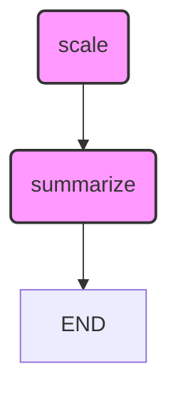

1.  **State Definition**:
    *   The `AgentState` [`class`](01-Graphs/04-Multiple_Inputs.ipynb:8) defines the structure of the data that the graph will operate on. It includes:
        *   `scores`: A list of floating-point numbers.
        *   `multiplier`: A floating-point number used to scale the scores.
        *   `scaled_scores`: A list to store the scaled scores.
        *   `summary`: A string to store a summary of the processing.
2.  **Node Functions**:
    *   `scale_scores` [`def`](01-Graphs/04-Multiple_Inputs.ipynb:20) Node: This node takes the `scores` and `multiplier` from the `AgentState`, multiplies each score by the multiplier, and stores the results in `scaled_scores`.
    *   `make_summary` [`def`](01-Graphs/04-Multiple_Inputs.ipynb:36) Node: This node takes the `scaled_scores` from the `AgentState`, calculates the average, and generates a summary message that includes the multiplier, scaled scores, and average.
3.  **Graph Creation**:
    *   A `StateGraph` is created using the `AgentState` to manage the state transitions.
    *   The `scale_scores` and `make_summary` functions are added as nodes to the graph.
    *   Edges are added to define the flow: `scale_scores` -> `make_summary` -> `END`.
    *   The entry point is set to `scale_scores`, and the finish point is set to `summarize`.
    *   The graph is compiled into an executable `app`.
4.  **Graph Visualization**:
    *   The code generates a visual representation of the graph using `app.get_graph().draw_mermaid_png()` and saves it to a file named `output/04-Multiple_Inputs.png`.
    *   Here is the Mermaid diagram:

5.  **Graph Execution**:
    *   The `app.invoke()` method is called with an initial state containing a list of `scores` and a `multiplier`.
    *   The graph executes, scaling the scores and generating a summary.
    *   The final summary is printed to the console.