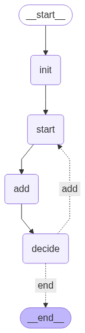

# 01-Graphs: LangGraph Core Concepts

This directory contains a series of tutorials and examples that introduce the fundamental concepts of building with LangGraph. Each sub-directory focuses on a specific feature, providing a clear and concise demonstration of how to use it.

## Table of Contents

1.  [**Graph Basics (`03-Graph_Basics`)**](#1-graph-basics-03-graph_basics)
2.  [**Handling Multiple Inputs (`04-Multiple_Inputs`)**](#2-handling-multiple-inputs-04-multiple_inputs)
3.  [**Conditional Routing (`05-Conditional_Routing`)**](#3-conditional-routing-05-conditional_routing)
4.  [**Looping Logic (`06-Looping_Logic`)**](#4-looping-logic-06-looping_logic)
5.  [**Basic Chat Graph (`07-Basic_Chat_Graph`)**](#5-basic-chat-graph-07-basic_chat_graph)

---

### 1. Graph Basics (`03-Graph_Basics`)

This tutorial introduces the core concepts of `StateGraph`, the primary tool for building stateful, multi-actor applications with LangGraph.

**Key Concepts Covered:**

-   **State Schema**: Defining the structure of your graph's state using `TypedDict`.
-   **Nodes**: Creating functions that process the state.
-   **Graph Compilation**: Compiling the graph into a runnable application.

**Example:**

A simple graph that takes a name and returns a greeting.

---

### 2. Handling Multiple Inputs (`04-Multiple_Inputs`)

This example demonstrates how to work with a state that has multiple fields, using a student grade calculator as a practical use case.

**Key Concepts Covered:**

-   Defining a state with multiple fields (`scores`, `student_name`, etc.).
-   Creating a node that reads from multiple state fields to perform a calculation.
-   Visualizing the graph and saving the output.

**Example:**

A graph that calculates a student's final grade based on a list of scores.

---

### 3. Conditional Routing (`05-Conditional_Routing`)

This tutorial explains how to use conditional edges to dynamically route the flow of your graph based on the current state.

**Key Concepts Covered:**

-   **Router Functions**: Creating functions that determine the next node to execute.
-   `add_conditional_edges()`: Wiring up the graph to follow different paths based on the router's output.

**Examples:**

1.  A number processing graph that routes to different nodes based on whether a number is positive, negative, or zero.
2.  A text processing graph that routes messages based on their length.

---

### 4. Looping Logic (`06-Looping_Logic`)

This tutorial demonstrates how to create loops within a LangGraph, allowing for iterative processing until a certain condition is met.

**Key Concepts Covered:**

-   **Direct Looping**: Creating a loop by adding a conditional edge from a node back to itself.
-   **Looping with a Decision Node**: Using a separate node to make the decision to loop or exit, which can be useful for more complex logic.

**Example:**

A graph that adds random numbers to a list until the total sum reaches a specified threshold.

**Direct Loop:**

**Loop with Decision Node:**

---

### 5. Basic Chat Graph (`07-Basic_Chat_Graph`)

This example ties together the concepts from the previous tutorials to build a basic, interactive chat application.

**Key Concepts Covered:**

-   Managing a conversation history in the state.
-   Processing user input and generating AI responses.
-   Handling commands to control the application (e.g., `exit`, `verbose`).

**Example:**

A command-line chat application that uses an LLM to respond to user messages.

