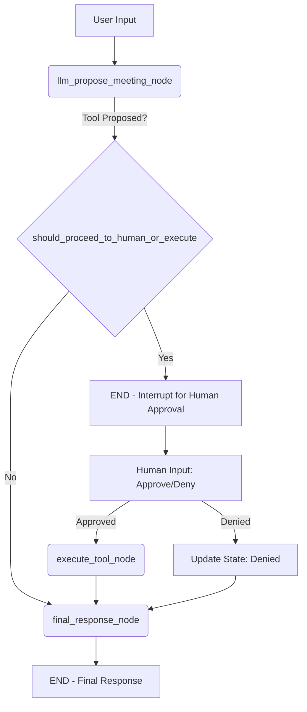

# LangGraph Human-in-the-Loop Tutorial - v2

This tutorial provides a streamlined and focused demonstration of implementing human-in-the-loop (HIL) workflows with LangGraph. It emphasizes clarity on graph interruption, state persistence using checkpoints, and resuming execution after human feedback.

## 📚 What You'll Learn (v2 Focus)

- **Simplified HIL Scenario**: A clear example using a single tool (meeting scheduler) that may require human confirmation.
- **Graph Interruption**: How to design a graph that explicitly pauses when human input is needed by routing to `END`.
- **State Persistence with Checkpoints**: Using `SqliteSaver` to maintain the agent's state across interruptions, ensuring context is not lost.
- **Human Feedback Integration**: How to capture human decisions (approve/deny) and update the agent's state accordingly.
- **Resuming Graph Execution**: A simplified approach to resuming or continuing the workflow after human intervention, focusing on the conceptual flow.
- **Interactive Demonstration**: An interactive loop that clearly shows the pause, human input, and continuation steps.

## 🔧 Scenario: Meeting Scheduler with Confirmation

The agent assists in scheduling meetings. When the LLM proposes to schedule a meeting using the `schedule_meeting` tool, the graph pauses to ask for human confirmation before proceeding with the actual tool execution.

**Tool:**
- `schedule_meeting(topic, time, attendees)`: Initiates scheduling a meeting.

**State:**
- `messages`: Conversation history.
- `human_approved`: Stores the human's decision (`True`, `False`, or `None`).
- `proposed_meeting_details`: Stores the arguments for the `schedule_meeting` tool if proposed by the LLM.

## 🏗️ Graph Architecture (v2)

The graph is designed to pause when a meeting scheduling action is proposed:

1.  **`llm_propose_meeting_node`**: The LLM processes user input. If it decides to use the `schedule_meeting` tool, it populates `proposed_meeting_details`.
2.  **`should_proceed_to_human_or_execute` (Router)**:
    *   If `proposed_meeting_details` is set (tool call proposed), the graph routes to `END`. This signifies an **interruption point** named `human_approval_check`.
    *   If no tool is proposed, it routes to `final_response_node`.
3.  **Human Interaction (Outside the graph execution for this `invoke` call)**:
    *   The interactive loop detects the interruption (because `proposed_meeting_details` is set and `human_approved` is `None`).
    *   It prompts the user for approval.
    *   The user's decision updates the `human_approved` field in the state.
4.  **Resuming/Continuing Workflow (Simplified in v2)**:
    *   If **approved**: The `execute_tool_node` logic is called manually with the updated state, followed by `final_response_node`.
    *   If **denied**: An appropriate message is added to the state, and `final_response_node` logic might be called or a direct message shown.
5.  **`execute_tool_node`**: If the action was approved, this node executes the `schedule_meeting` tool.
6.  **`final_response_node`**: The LLM generates a concluding message based on the outcome (tool execution, human denial, or no action).


*Note: The "Resuming/Continuing Workflow" part is handled by the interactive script logic in this v2, re-engaging node logic rather than a direct graph `invoke` from an arbitrary mid-point.*

## 🚀 Running the Tutorial

### Prerequisites

Ensure you have the necessary packages:
```bash
pip install langgraph langchain_openai langchain_core typing_extensions
```
And set your OpenAI API key:
```bash
export OPENAI_API_KEY="your-api-key-here"
```

### Execution

Run the script:
```bash
python 04-Human-in-the-Loop-v2.py
```
Follow the prompts. Try asking the agent to schedule a meeting, for example:
`"Schedule a project review for next Monday at 3 PM with 'jane@example.com' and 'mark@example.com'"`

## 💡 Key Concepts Demonstrated (v2)

- **Intentional Interruption**: Designing the graph to `END` at a specific conditional branch to signal the need for human input.
- **State-Driven HIL**: Using fields in the agent state (`human_approved`, `proposed_meeting_details`) to manage the HIL flow.
- **Checkpointing for Persistence**: `SqliteSaver` ensures that if the application were to stop and restart (not fully simulated here, but the mechanism is present), the state up to the interruption point could be recovered.
- **Simplified Resumption Logic**: For tutorial clarity, this version manually invokes node logic after human input rather than complex graph `update` and `invoke` sequences from arbitrary start points. This keeps the focus on the HIL decision process.
- **Clear User Prompts**: The interactive loop clearly indicates when human approval is needed and what the proposed action is.

## 🔍 How Interruption and Resumption Works (Conceptual)

1.  **Interruption**:
    *   The `llm_propose_meeting_node` suggests a tool call.
    *   The `should_proceed_to_human_or_execute` router detects this.
    *   It routes the graph to `END`. The `agent_graph.stream()` or `invoke()` call finishes.
    *   The application code (interactive loop) inspects the final state. If `proposed_meeting_details` is present and `human_approved` is `None`, it knows an interruption for HIL occurred.

2.  **Human Input**:
    *   The application prompts the human.
    *   The human's decision is captured.

3.  **State Update & Continuation (Simplified for v2)**:
    *   The application updates the `human_approved` field in the *current state object*.
    *   **If approved**: The logic of `execute_tool_node` is called with this updated state, followed by `final_response_node`.
    *   **If denied**: An appropriate message is added, and potentially `final_response_node` logic is called or a direct message is shown.
    *   The new state (after these manual calls) is saved using `memory.put(config, current_state)`.
    *   The loop continues, ready for the next user input.

This v2 script aims to make the core idea of pausing for human input and then acting on that input as clear as possible within the LangGraph framework.
