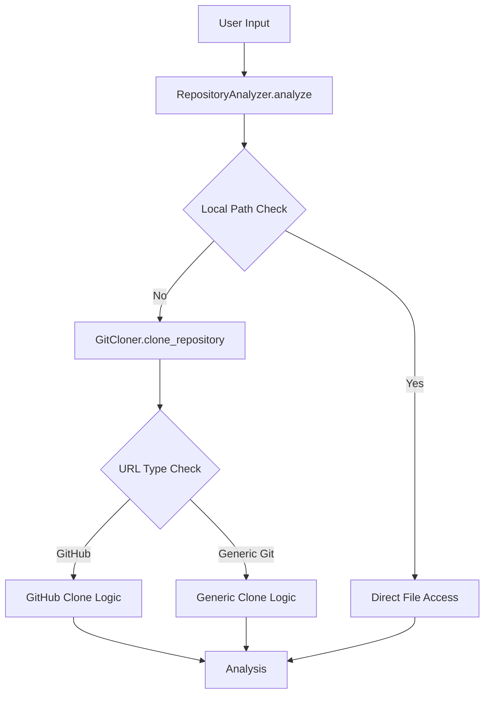
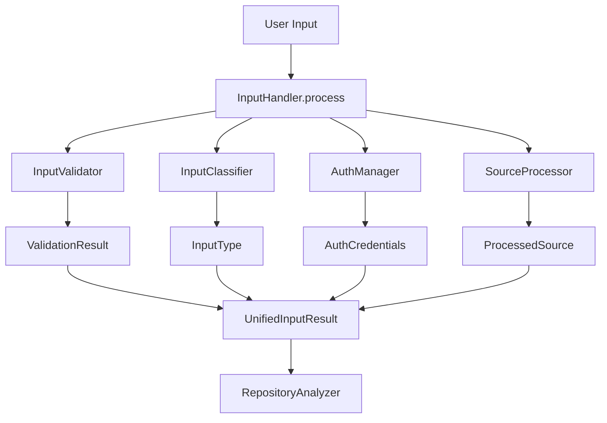
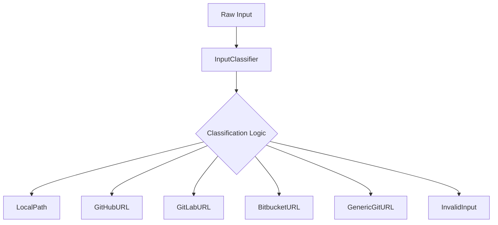
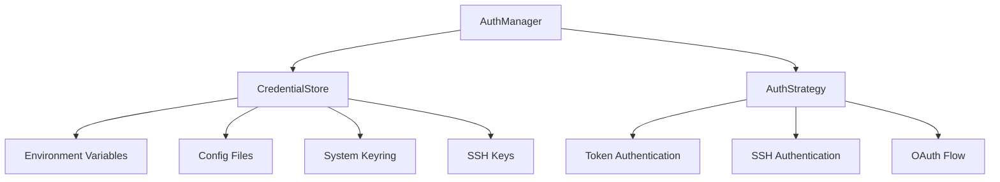
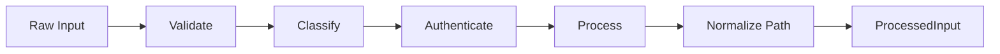
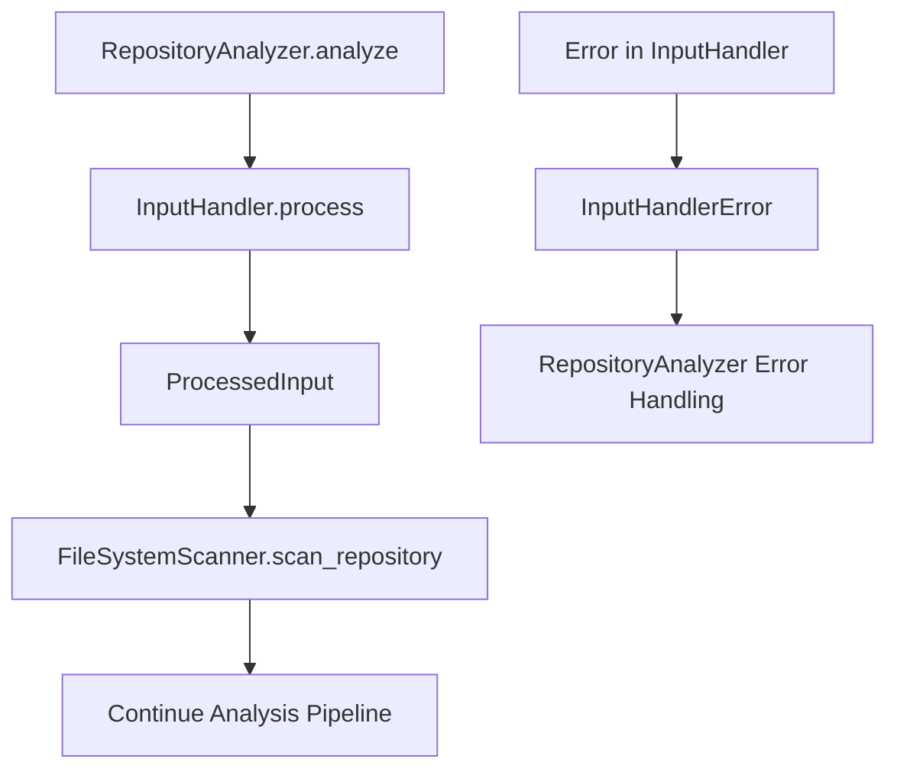
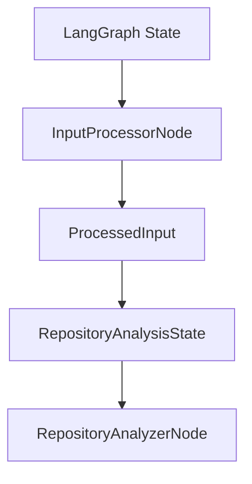

# InputHandler System Design

## Overview

This document outlines the design for a unified InputHandler system that centralizes all input validation and processing for the LangGraph Agent. The system will replace the scattered input handling logic currently spread across GitCloner and RepositoryAnalyzer classes.

## Current State Analysis

### Existing Input Handling Issues
- **Scattered Logic**: Input validation spread across multiple classes
- **Inconsistent Error Handling**: Different error types and messages across components
- **Limited Authentication**: Basic token support only for GitHub
- **No Input Normalization**: URL parsing logic is duplicated
- **Poor Separation of Concerns**: Repository analysis mixed with input processing

### Current Flow


## Proposed InputHandler System Architecture

### High-Level Architecture


### Core Components

#### 1. InputHandler (Main Interface)
```python
class InputHandler:
    """Unified input processing system for repository sources."""
    
    def process(self, source: str, config: InputConfig) -> ProcessedInput:
        """Process and validate input source."""
    
    def cleanup(self, processed_input: ProcessedInput) -> bool:
        """Clean up temporary resources."""
```

#### 2. Input Classification System


#### 3. Authentication Management


#### 4. Input Processing Pipeline


## Data Structures

### InputType Enumeration
```python
class InputType(Enum):
    LOCAL_PATH = "local_path"
    GITHUB_URL = "github_url"
    GITLAB_URL = "gitlab_url"
    BITBUCKET_URL = "bitbucket_url"
    GENERIC_GIT_URL = "generic_git_url"
    ARCHIVE_URL = "archive_url"
```

### ProcessedInput Data Class
```python
@dataclass
class ProcessedInput:
    source: str
    input_type: InputType
    local_path: str
    is_temporary: bool
    auth_used: bool
    provider: Optional[str]
    cleanup_callback: Optional[Callable]
    metadata: Dict[str, Any]
```

### InputConfig Data Class
```python
@dataclass
class InputConfig:
    auth_config: AuthConfig
    temp_dir: Optional[str]
    timeout: int
    retry_attempts: int
    respect_gitignore: bool
    max_repo_size: int
    allowed_extensions: List[str]
```

## Security Considerations

### Authentication Security
- **Credential Storage**: Use system keyring when available
- **Token Masking**: Never log or expose tokens in error messages
- **SSH Key Security**: Validate SSH key permissions and ownership
- **Environment Isolation**: Separate credentials by environment

### Input Validation Security
- **Path Traversal Prevention**: Validate local paths for directory traversal attacks
- **URL Validation**: Strict URL parsing and validation
- **Size Limits**: Enforce maximum repository size limits
- **File Type Filtering**: Restrict allowed file extensions

## Error Handling Strategy

### Exception Hierarchy
```python
class InputHandlerError(RepositoryAnalyzerError):
    """Base exception for input handler errors."""

class InputValidationError(InputHandlerError):
    """Input validation failed."""

class InputAuthenticationError(InputHandlerError):
    """Authentication failed for input source."""

class InputProcessingError(InputHandlerError):
    """Input processing failed."""

class InputTimeoutError(InputHandlerError):
    """Input processing timed out."""
```

### Error Recovery
- **Graceful Degradation**: Fall back to public access when auth fails
- **Retry Logic**: Configurable retry attempts with exponential backoff
- **Detailed Error Messages**: Provide actionable error information
- **Context Preservation**: Maintain error context for debugging

## Integration Strategy

### Seamless Integration with RepositoryAnalyzer


### LangGraph Node Integration


## Configuration Management

### Environment-Based Configuration
```yaml
# config.yaml
input_handler:
  authentication:
    github_token: ${GITHUB_TOKEN}
    gitlab_token: ${GITLAB_TOKEN}
    ssh_key_path: ${SSH_KEY_PATH}
  
  processing:
    timeout: 300
    retry_attempts: 3
    temp_dir: /tmp/repo_analyzer
    max_repo_size: 500MB
  
  validation:
    allowed_extensions: [".py", ".js", ".ts", ".java", ".go"]
    respect_gitignore: true
```

## Testing Strategy

### Unit Testing Coverage
- **Input Validation**: Test all input types and edge cases
- **Authentication**: Mock authentication scenarios
- **Error Handling**: Test all error conditions
- **Cleanup**: Verify proper resource cleanup

### Integration Testing
- **End-to-End Workflows**: Test complete input processing flows
- **LangGraph Integration**: Test node integration
- **Multi-Provider Support**: Test different Git providers

### Security Testing
- **Path Traversal**: Test directory traversal prevention
- **Credential Security**: Test credential handling security
- **Input Sanitization**: Test malicious input handling

## Migration Strategy

### Phase 1: Create InputHandler Infrastructure
1. Implement core InputHandler class
2. Create input validation framework
3. Implement authentication management
4. Add comprehensive error handling

### Phase 2: Integrate with Existing System
1. Update RepositoryAnalyzer to use InputHandler
2. Modify LangGraph nodes to use new system
3. Update configuration management
4. Add migration utilities

### Phase 3: Deprecate Old System
1. Remove old input handling logic from GitCloner
2. Clean up redundant code in RepositoryAnalyzer
3. Update documentation and examples
4. Remove deprecated methods

## Performance Considerations

### Optimization Strategies
- **Caching**: Cache validation results for repeated inputs
- **Parallel Processing**: Support concurrent input processing
- **Lazy Loading**: Load authentication credentials only when needed
- **Resource Pooling**: Pool temporary directories for reuse

### Monitoring and Metrics
- **Processing Time**: Track input processing duration
- **Success Rates**: Monitor success/failure rates by input type
- **Authentication Usage**: Track authentication method usage
- **Resource Usage**: Monitor temporary directory usage

## Future Enhancements

### Planned Extensions
- **Archive Support**: Support for ZIP/TAR archive inputs
- **Direct API Integration**: GitHub API for metadata without cloning
- **Incremental Updates**: Support for repository update detection
- **Advanced Caching**: Persistent cache for repeated repository access
- **Multi-Source Support**: Support for multiple input sources in single analysis

This design provides a solid foundation for a unified, secure, and extensible input handling system that will significantly improve the architecture and maintainability of the LangGraph Agent.