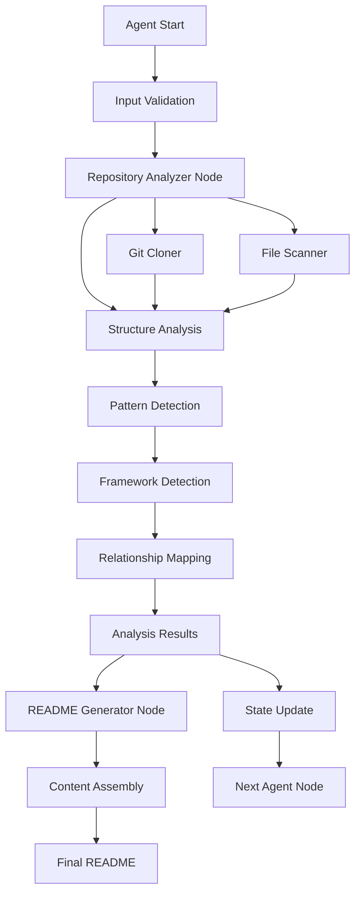

# Repository Analyzer - LangGraph Agent Integration

## Integration Overview

The Repository Structure Analysis Component is designed as a standalone module that integrates seamlessly with LangGraph agents for automated README generation and repository analysis workflows.

## LangGraph Workflow Integration



## Agent State Schema

```python
from typing import TypedDict, Optional, List, Dict, Any
from repository_analyzer import RepositoryStructure

class READMEAgentState(TypedDict):
    # Input
    repository_url: str
    target_audience: Optional[str]
    readme_style: Optional[str]
    
    # Repository Analysis Results
    repository_structure: Optional[RepositoryStructure]
    analysis_summary: Optional[Dict[str, Any]]
    
    # Generated Content
    readme_sections: Optional[Dict[str, str]]
    final_readme: Optional[str]
    
    # Process Management
    current_step: str
    errors: List[str]
    warnings: List[str]
```

## Node Implementation

```python
from langgraph import StateGraph, END
from repository_analyzer import RepositoryAnalyzer, AnalysisConfig

class RepositoryAnalyzerNode:
    """LangGraph node for repository structure analysis"""
    
    def __init__(self, config: AnalysisConfig = None):
        self.analyzer = RepositoryAnalyzer(config or AnalysisConfig())
    
    def __call__(self, state: READMEAgentState) -> READMEAgentState:
        try:
            # Extract repository URL from state
            repo_url = state["repository_url"]
            
            # Perform analysis
            structure = self.analyzer.analyze(repo_url)
            
            # Create analysis summary
            summary = {
                "project_name": structure.metadata.name,
                "primary_language": structure.metadata.primary_language,
                "frameworks": [f.name for f in structure.frameworks],
                "architecture": structure.metadata.architecture_type,
                "complexity_score": structure.metadata.complexity_score,
                "key_directories": list(structure.directories.keys()),
                "entry_points": structure.metadata.entry_points,
                "has_tests": any("test" in d.type.value.lower() 
                               for d in structure.directories.values()),
                "has_docs": any("doc" in d.type.value.lower() 
                              for d in structure.directories.values())
            }
            
            # Update state
            return {
                **state,
                "repository_structure": structure,
                "analysis_summary": summary,
                "current_step": "analysis_complete"
            }
            
        except Exception as e:
            return {
                **state,
                "errors": state.get("errors", []) + [str(e)],
                "current_step": "analysis_failed"
            }
```

## Complete Workflow Definition

```python
def create_readme_generation_workflow():
    """Create the complete LangGraph workflow for README generation"""
    
    workflow = StateGraph(READMEAgentState)
    
    # Add nodes
    workflow.add_node("validate_input", validate_input_node)
    workflow.add_node("analyze_repository", RepositoryAnalyzerNode())
    workflow.add_node("generate_overview", generate_overview_node)
    workflow.add_node("generate_installation", generate_installation_node)
    workflow.add_node("generate_usage", generate_usage_node)
    workflow.add_node("generate_api_docs", generate_api_docs_node)
    workflow.add_node("assemble_readme", assemble_readme_node)
    
    # Define edges
    workflow.add_edge("validate_input", "analyze_repository")
    workflow.add_edge("analyze_repository", "generate_overview")
    workflow.add_edge("generate_overview", "generate_installation")
    workflow.add_edge("generate_installation", "generate_usage")
    workflow.add_edge("generate_usage", "generate_api_docs")
    workflow.add_edge("generate_api_docs", "assemble_readme")
    workflow.add_edge("assemble_readme", END)
    
    # Set entry point
    workflow.set_entry_point("validate_input")
    
    return workflow.compile()
```

## Usage Examples

### Basic Integration

```python
from repository_analyzer.langgraph import get_analyzer_node
from repository_analyzer import AnalysisConfig

# Create analyzer node with custom config
config = AnalysisConfig(
    max_depth=8,
    analyze_imports=True,
    detect_frameworks=True,
    ignore_patterns=[".git", "__pycache__", "node_modules"]
)

analyzer_node = get_analyzer_node(config)

# Use in LangGraph workflow
workflow = StateGraph(READMEAgentState)
workflow.add_node("repository_analysis", analyzer_node)
```

### Standalone Usage

```python
from repository_analyzer import RepositoryAnalyzer

# Analyze a GitHub repository
analyzer = RepositoryAnalyzer()
structure = analyzer.analyze("https://github.com/user/repo")

# Access analysis results
print(f"Project: {structure.metadata.name}")
print(f"Language: {structure.metadata.primary_language}")
print(f"Frameworks: {[f.name for f in structure.frameworks]}")
print(f"Directories: {list(structure.directories.keys())}")
```

### Async Integration

```python
import asyncio
from repository_analyzer import RepositoryAnalyzer

async def analyze_multiple_repos(urls: List[str]):
    analyzer = RepositoryAnalyzer()
    tasks = [analyzer.analyze_async(url) for url in urls]
    results = await asyncio.gather(*tasks)
    return results
```

## Configuration for Different Use Cases

### Lightweight Analysis
```python
config = AnalysisConfig(
    max_depth=5,
    analyze_imports=False,
    detect_frameworks=True,
    map_relationships=False
)
```

### Deep Analysis
```python
config = AnalysisConfig(
    max_depth=15,
    analyze_imports=True,
    detect_frameworks=True,
    map_relationships=True,
    include_hidden=True
)
```

### Documentation-Focused
```python
config = AnalysisConfig(
    max_depth=10,
    analyze_imports=False,
    detect_frameworks=True,
    focus_on_docs=True,
    ignore_patterns=[".git", "__pycache__", "node_modules", "dist", "build"]
)
```

## Error Handling in Workflows

```python
def create_robust_workflow():
    workflow = StateGraph(READMEAgentState)
    
    def error_handler(state: READMEAgentState) -> READMEAgentState:
        if state.get("errors"):
            # Log errors and continue with partial analysis
            return {
                **state,
                "current_step": "error_recovery",
                "warnings": state.get("warnings", []) + 
                           ["Analysis completed with errors"]
            }
        return state
    
    workflow.add_node("analyze_repository", RepositoryAnalyzerNode())
    workflow.add_node("handle_errors", error_handler)
    
    # Conditional routing based on errors
    def should_handle_errors(state: READMEAgentState) -> str:
        return "handle_errors" if state.get("errors") else "continue_analysis"
    
    workflow.add_conditional_edges(
        "analyze_repository",
        should_handle_errors,
        {
            "handle_errors": "handle_errors",
            "continue_analysis": "generate_overview"
        }
    )
    
    return workflow.compile()
```

## Performance Considerations

### Caching Strategy
```python
from functools import lru_cache
import hashlib

class CachedRepositoryAnalyzer(RepositoryAnalyzer):
    @lru_cache(maxsize=100)
    def analyze_cached(self, repo_hash: str, repo_url: str):
        return super().analyze(repo_url)
    
    def analyze(self, repo_url: str):
        # Create hash of URL for caching
        repo_hash = hashlib.md5(repo_url.encode()).hexdigest()
        return self.analyze_cached(repo_hash, repo_url)
```

### Parallel Processing
```python
from concurrent.futures import ThreadPoolExecutor

class ParallelRepositoryAnalyzer(RepositoryAnalyzer):
    def __init__(self, max_workers: int = 4, **kwargs):
        super().__init__(**kwargs)
        self.max_workers = max_workers
    
    def analyze_batch(self, urls: List[str]) -> List[RepositoryStructure]:
        with ThreadPoolExecutor(max_workers=self.max_workers) as executor:
            results = list(executor.map(self.analyze, urls))
        return results
```

This integration design ensures the Repository Structure Analysis Component works seamlessly within the broader LangGraph Agent ecosystem while maintaining modularity and reusability.