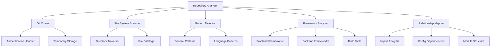

# Repository Structure Analysis Component Design

## Overview
A comprehensive Python component for the LangGraph Agent that analyzes GitHub repositories and local file systems to extract structural information, identify patterns, and map relationships between project components.

## Core Architecture

### 1. Data Structures

#### RepositoryStructure
```python
@dataclass
class RepositoryStructure:
    source: str  # GitHub URL or local path
    root_path: str
    project_type: ProjectType
    frameworks: List[Framework]
    directories: Dict[str, DirectoryInfo]
    files: Dict[str, FileInfo]
    patterns: List[Pattern]
    relationships: List[Relationship]
    metadata: RepositoryMetadata
```

#### DirectoryInfo
```python
@dataclass
class DirectoryInfo:
    name: str
    path: str
    type: DirectoryType  # SOURCE, CONFIG, DOCS, TESTS, ASSETS, etc.
    purpose: str
    children: List[str]
    file_count: int
    patterns: List[str]
```

#### FileInfo
```python
@dataclass
class FileInfo:
    name: str
    path: str
    extension: str
    size: int
    type: FileType  # CONFIG, SOURCE, DOC, TEST, etc.
    language: Optional[str]
    framework_markers: List[str]
    imports: List[str]  # For source files
```

### 2. Component Architecture



### 3. Core Components

#### GitCloner
- Handles GitHub URL parsing and validation
- Manages authentication (tokens, SSH keys)
- Clones repositories to temporary locations
- Supports both public and private repositories
- Cleanup and temporary file management

#### FileSystemScanner
- Recursive directory traversal with configurable depth
- File type detection and categorization
- **Automatic .gitignore parsing and enforcement** - respects repository's ignore rules by default
- Additional ignore pattern support for custom exclusions
- Symbolic link handling
- Performance optimization for large repositories

#### PatternDetector
- **General Patterns**: src/, lib/, docs/, tests/, config/, assets/
- **Language Patterns**: Python packages, Node.js modules, Java packages
- **Architecture Patterns**: Microservices, monorepo, modular structure
- **Documentation Patterns**: README hierarchies, wiki structures

#### FrameworkAnalyzer
- **Frontend**: React, Vue, Angular, Svelte detection
- **Backend**: Django, Flask, FastAPI, Spring Boot, Express
- **Mobile**: React Native, Flutter, Xamarin
- **Build Tools**: Webpack, Vite, Gradle, Maven, npm scripts

#### RelationshipMapper
- Import/dependency analysis between modules
- Configuration file relationships
- Documentation-to-code mapping
- Test-to-source mapping
- Asset dependencies

### 4. LangGraph Integration

#### Nodes
```python
class RepositoryAnalyzerNode:
    """LangGraph node for repository analysis"""
    
    def __call__(self, state: AgentState) -> AgentState:
        # Extract repository URL/path from state
        # Perform analysis
        # Update state with analysis results
        pass
```

#### State Schema
```python
class AgentState(TypedDict):
    repository_url: str
    local_path: Optional[str]
    analysis_result: Optional[RepositoryStructure]
    analysis_depth: str  # "shallow", "medium", "deep"
    error_messages: List[str]
```

### 5. Configuration System

#### AnalysisConfig
```python
@dataclass
class AnalysisConfig:
    max_depth: int = 10
    respect_gitignore: bool = True  # Parse and apply .gitignore rules by default
    ignore_patterns: List[str] = field(default_factory=list)  # Additional custom patterns
    include_hidden: bool = False
    analyze_imports: bool = True
    detect_frameworks: bool = True
    map_relationships: bool = True
    temp_dir: Optional[str] = None
    git_auth_token: Optional[str] = None
```

### 6. Pattern Detection Rules

#### Directory Patterns
- `src/`, `source/`, `lib/` → Source code
- `test/`, `tests/`, `__tests__/` → Test files
- `docs/`, `documentation/`, `wiki/` → Documentation
- `config/`, `conf/`, `settings/` → Configuration
- `assets/`, `static/`, `public/` → Static assets
- `scripts/`, `bin/`, `tools/` → Utility scripts

#### Framework Detection
- **package.json** + **React imports** → React project
- **requirements.txt** + **Django imports** → Django project
- **pom.xml** + **Spring annotations** → Spring Boot project
- **Cargo.toml** → Rust project
- **go.mod** → Go project

### 7. Output Format

#### Analysis Summary
```python
@dataclass
class AnalysisSummary:
    project_name: str
    primary_language: str
    frameworks: List[str]
    architecture_type: str  # "monolith", "microservices", "library"
    complexity_score: float
    documentation_coverage: float
    test_coverage_estimate: float
    key_directories: List[str]
    entry_points: List[str]
    configuration_files: List[str]
```

## Implementation Strategy

### Phase 1: Core Infrastructure
1. Set up project structure and dependencies
2. Implement basic data structures
3. Create Git cloning functionality
4. Build file system scanning

### Phase 2: Pattern Detection
1. Implement general directory patterns
2. Add file type detection
3. Create framework detection rules
4. Build relationship mapping

### Phase 3: LangGraph Integration
1. Design LangGraph node interface
2. Implement state management
3. Add error handling and validation
4. Create configuration system

### Phase 4: Advanced Features
1. Add comprehensive framework detection
2. Implement relationship analysis
3. Create performance optimizations
4. Add extensive testing

## Dependencies

### Core Dependencies
- `langgraph`: LangGraph framework integration
- `gitpython`: Git repository operations
- `pathlib`: Path manipulation
- `dataclasses`: Data structure definitions
- `typing`: Type annotations

### Optional Dependencies
- `pygithub`: Enhanced GitHub API integration
- `tree-sitter`: Advanced code parsing
- `toml`, `yaml`, `json`: Configuration file parsing
- `chardet`: File encoding detection

## Error Handling

### Exception Types
- `RepositoryNotFoundError`: Invalid GitHub URL or path
- `AuthenticationError`: Git authentication failures
- `AnalysisError`: General analysis failures
- `ConfigurationError`: Invalid configuration
- `PermissionError`: File system access issues

### Retry Logic
- Network-related failures with exponential backoff
- Temporary file system issues
- Rate limiting handling for GitHub API

## Performance Considerations

### Optimization Strategies
- Lazy loading of file contents
- Configurable analysis depth
- Parallel processing for large repositories
- Caching of analysis results
- Memory-efficient streaming for large files

### Resource Management
- Temporary file cleanup
- Memory usage monitoring
- Configurable timeout limits
- Progress reporting for long operations

## Security Considerations

### Authentication
- Secure token storage
- SSH key support
- Environment variable configuration
- Token scope validation

### File System Safety
- Sandbox execution environment
- Path traversal prevention
- File size limitations
- Malicious content detection

This design provides a comprehensive foundation for implementing the repository structure analysis component that will integrate seamlessly with your LangGraph Agent for automated README generation.