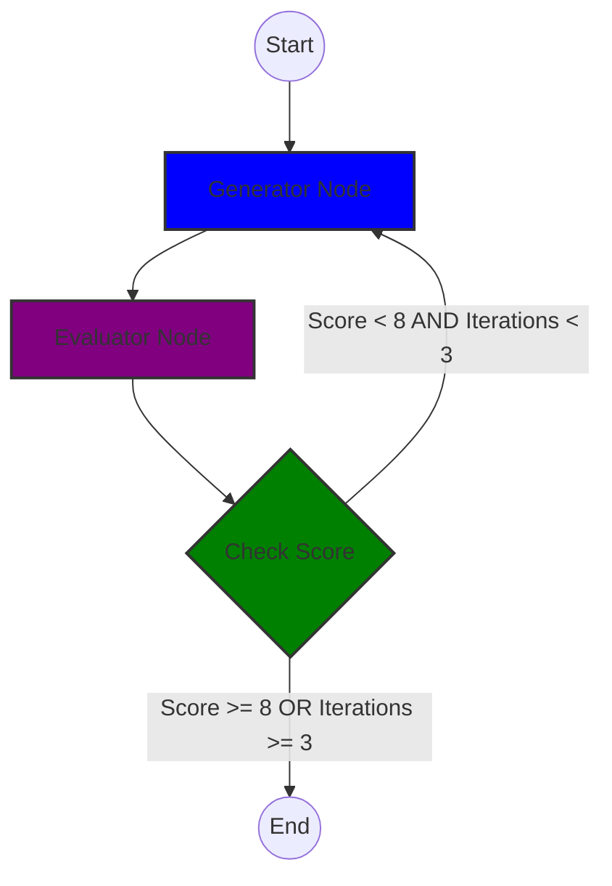

# Evaluator-Optimizer Agent in LangGraph

This example demonstrates the **Evaluator-Optimizer** design pattern. It creates an iterative loop where one LLM call generates content and another LLM call critiques it to improve the final output.

## Overview

The agent's goal is to generate a high-quality joke. The process involves two main nodes:

1. **Generator Node**: Produces a joke based on the current state.
2. **Evaluator Node**: Reviews the joke and provides feedback along with a numeric score.
The agent continues this loop until the joke receives a score of 8 or higher, or until it reaches a maximum of 3 iterations to avoid excessive costs.

Evaluator Optimizer is useful in scenarios where quality is subjective and iterative refinement can lead to better results, such as creative writing, code generation, or design tasks.

## Key Features

- **Iterative Refinement**: The agent demonstrates how iterative feedback loops can improve output quality
- **Structured Evaluation**: Uses Pydantic models to ensure consistent evaluation format
- **Cost Control**: Implements iteration limits to prevent excessive API calls
- **Dynamic Prompting**: Generator node adapts its prompts based on previous feedback
- **Quality Thresholds**: Continues generating until a quality threshold is met

## Implementation Details

The implementation uses LangGraph to create a stateful, multi-agent system. Key components include:

1. **State Management**: The `AgentState` TypedDict tracks conversation history and iteration count
2. **Generator Node**: Dynamically adjusts prompts based on previous feedback
3. **Evaluator Node**: Uses structured output to ensure consistent evaluation format
4. **Conditional Logic**: Implements quality thresholds and iteration limits

The system demonstrates how to combine generation and evaluation in a feedback loop to improve output quality.

## Graph Visualization

## Core Components

### 1. State Management (`AgentState`)

A `TypedDict` that tracks the conversation history, including the current joke, the evaluator's feedback, the numeric score, and an iteration counter to prevent infinite loops.

### 2. The Generator Node (`generator_node`)

- **Role**: Acts as the "worker."
- **Logic**: If `feedback` exists in the state, it modifies its prompt to include the previous attempt and the critique.
- **Output**: Returns the new joke and increments the iteration count.

### 3. The Evaluator Node (`evaluator_node`)

- **Role**: Acts as the "critic."
- **Logic**: Uses `with_structured_output(Evaluation)` to force the LLM to return a Pydantic object.
- **Output**: A structured response containing a `score` (1-10) and specific `feedback`.

### 4. Conditional Logic (`should_continue`)

This function determines the graph's path after evaluation:

- **Success**: If the score is $\ge 8$, it routes to `END`.
- **Limit Reached**: If iterations reach 3, it routes to `END` to save costs/time.
- **Retry**: If the score is low, it routes back to the `generator` to try again.

## Key Features

- **Local LLM**: Configured to use Ollama with `llama3.2`.
- **Structured Output**: Demonstrates reliable data parsing for control flow.
- **Iterative Improvement**: Shows how agents can self-correct based on feedback.
