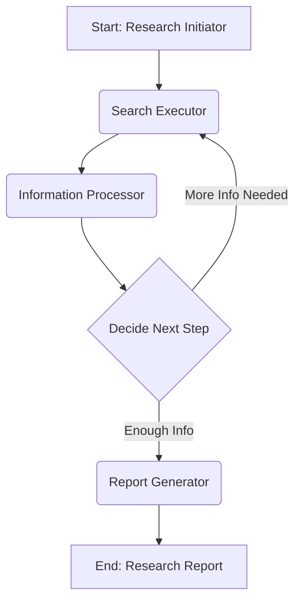

# Deep Research Agent Architecture

This document outlines the architecture for a Python-based deep research agent using LangGraph. The agent will receive a research topic from the user, search the internet for information, and generate a comprehensive research report.

## 1. Agent's Workflow

The agent operates as a state machine, progressing through distinct steps to accomplish the research task.

*   **State:** The agent's state will manage the research topic, collected information/documents, and the generated report. Key state variables include:
    *   `research_topic`: The initial query provided by the user.
    *   `search_results`: Raw results obtained from the internet search tool.
    *   `processed_information`: Synthesized and refined information derived from the LLM's analysis of search results.
    *   `report_content`: The evolving content of the research report, accumulated over iterations.
    *   `num_iterations`: A counter to track the number of research cycles, used to prevent infinite loops and manage research depth.

*   **Workflow Outline (State Machine Transitions):**
    1.  **Entry Point:** The process begins with the `research_initiator` node, which receives the user's research topic.
    2.  **Iterative Research Loop:**
        *   From either `research_initiator` (initial search) or `information_processor` (further research), the flow transitions to the `search_executor`.
        *   Upon completion of searching, `search_executor` transitions to `information_processor`.
        *   After processing information, `information_processor` transitions to a conditional `decide_next_step` node.
    3.  **Conditional Routing (`decide_next_step`):** This node acts as a router based on the current state:
        *   **More Information Needed:** If the `LLM` identifies gaps in the `processed_information` or if `num_iterations` is below a predefined threshold, the flow loops back to `search_executor` for additional research.
        *   **Enough Information Gathered:** If sufficient information is deemed available, the flow transitions to the `report_generator`.
    4.  **Exit Point:** The `report_generator` node marks the conclusion of the research process, producing the final report.

## 2. Key Components

The deep research agent leverages the following essential components:

*   **Internet Search Tool (e.g., Tavily, DuckDuckGo Search):** This component enables the agent to fetch relevant information from the internet. It will be abstracted as a generic "Search Tool" within the LangGraph implementation.
*   **Language Model (LLM):** A powerful LLM will be used for various tasks, including:
    *   Processing and synthesizing `search_results` into `processed_information`.
    *   Generating the final `report_content`.
    *   Potentially assisting the `decide_next_step` node in determining if more research is required.
*   **Agent State:** As described in the Workflow section, the agent's state is a mutable object that holds all necessary information for the agent's operation and progression through the graph.

## 3. LangGraph Graph Design

The following Mermaid diagram illustrates the flow and interactions between the nodes in the LangGraph graph:

**Node Descriptions:**

*   **`research_initiator` (Node Type: Start/Input):**
    *   **Function:** Receives the initial research topic from the user.
    *   **Output:** Initializes the agent's state with the `research_topic`.
*   **`search_executor` (Node Type: Tool Executor):**
    *   **Function:** Executes internet searches using the configured Search Tool.
    *   **Input:** `research_topic`, potentially refined search queries from `information_processor`.
    *   **Output:** Updates the agent's state with `search_results`.
*   **`information_processor` (Node Type: LLM Agent/Processor):**
    *   **Function:** Processes raw `search_results` using the LLM to synthesize information, extract key points, and identify knowledge gaps.
    *   **Input:** `search_results`.
    *   **Output:** Updates the agent's state with `processed_information`, potentially new search queries.
*   **`decide_next_step` (Node Type: Conditional Router):**
    *   **Function:** Evaluates the `processed_information` and `num_iterations` to determine the next action.
    *   **Input:** `processed_information`, `num_iterations`.
    *   **Output:** Routes to either `search_executor` (if more information is needed) or `report_generator` (if research is complete).
*   **`report_generator` (Node Type: LLM Agent/Generator):**
    *   **Function:** Uses the LLM to compile all `processed_information` into a comprehensive research report.
    *   **Input:** `processed_information`.
    *   **Output:** Updates the agent's state with `report_content`, signaling completion.
*   **`End: Research Report` (Node Type: End/Output):**
    *   **Function:** Represents the final output of the agent, the complete research report.